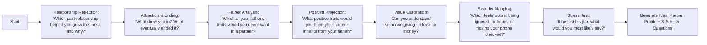

# Workflow Structure

```mermaid
graph LR
  A[Start] --> B["Relationship Reflection:<br>'Which past relationship helped you grow the most, and why?'"]
  B --> C["Attraction & Ending:<br>'What drew you in? What eventually ended it?'"]
  C --> D["Father Analysis:<br>'Which of your father's traits would you never want in a partner?'"]
  D --> E["Positive Projection:<br>'What positive traits would you hope your partner inherits from your father?'"]
  E --> F["Value Calibration:<br>'Can you understand someone giving up love for money?'"]
  F --> G["Security Mapping:<br>'Which feels worse: being ignored for hours, or having your phone checked?'"]
  G --> H["Stress Test:<br>'If he lost his job, what would you most likely say?'"]
  H --> I[Generate Ideal Partner Profile + 3–5 Filter Questions]
```